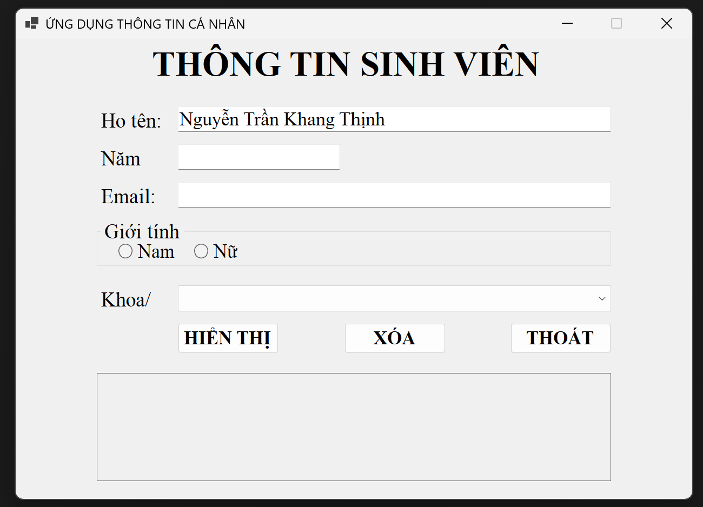
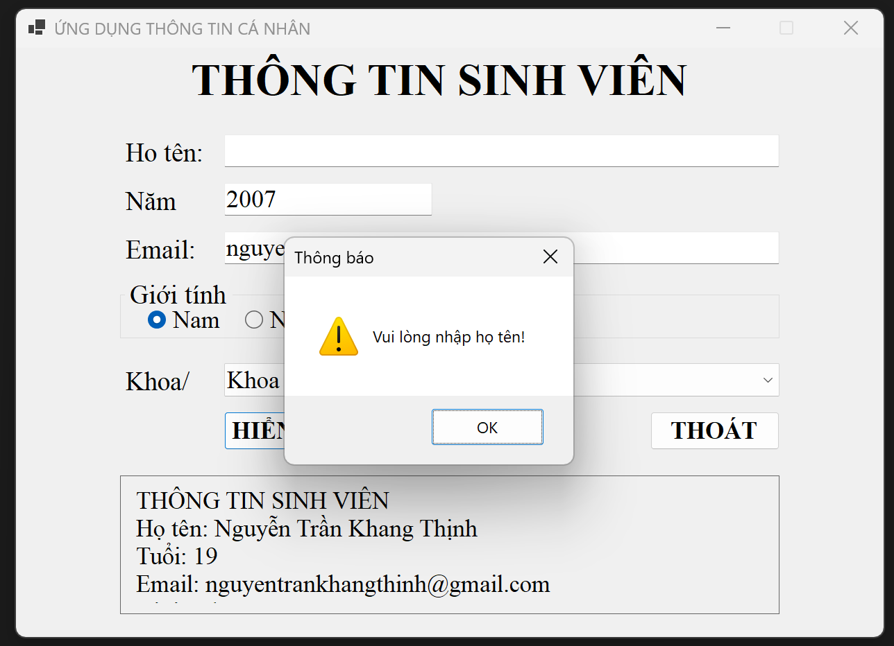
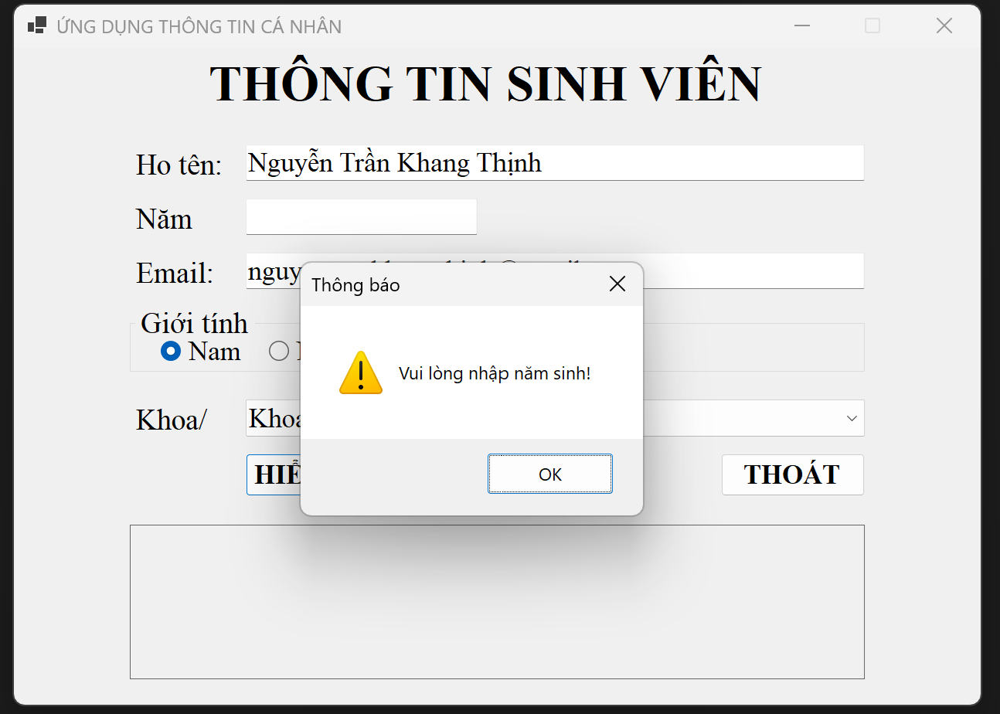
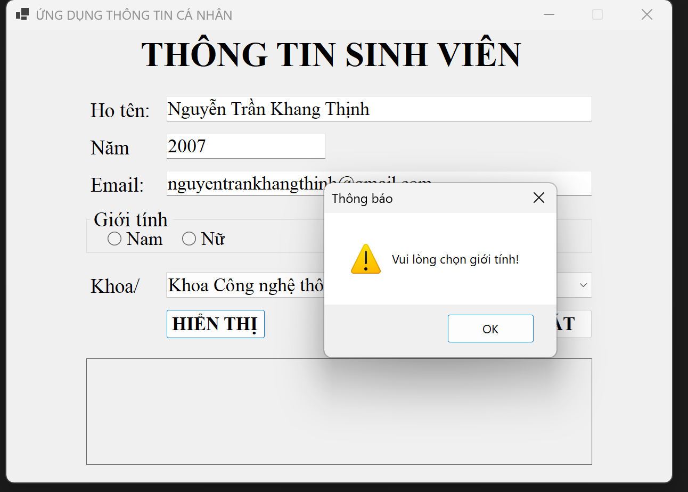
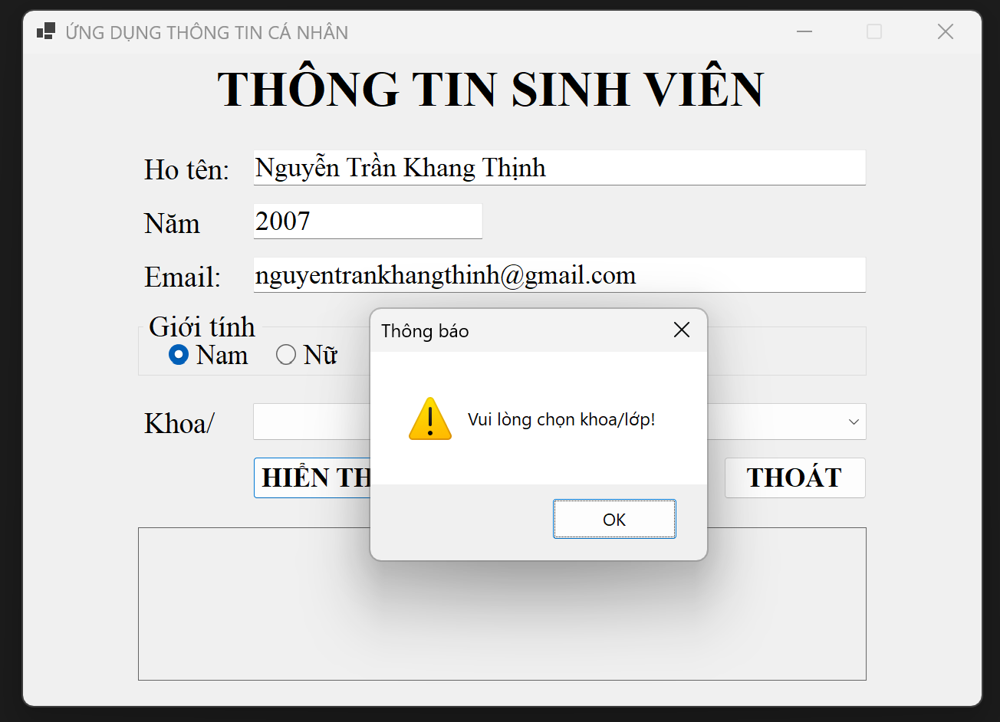
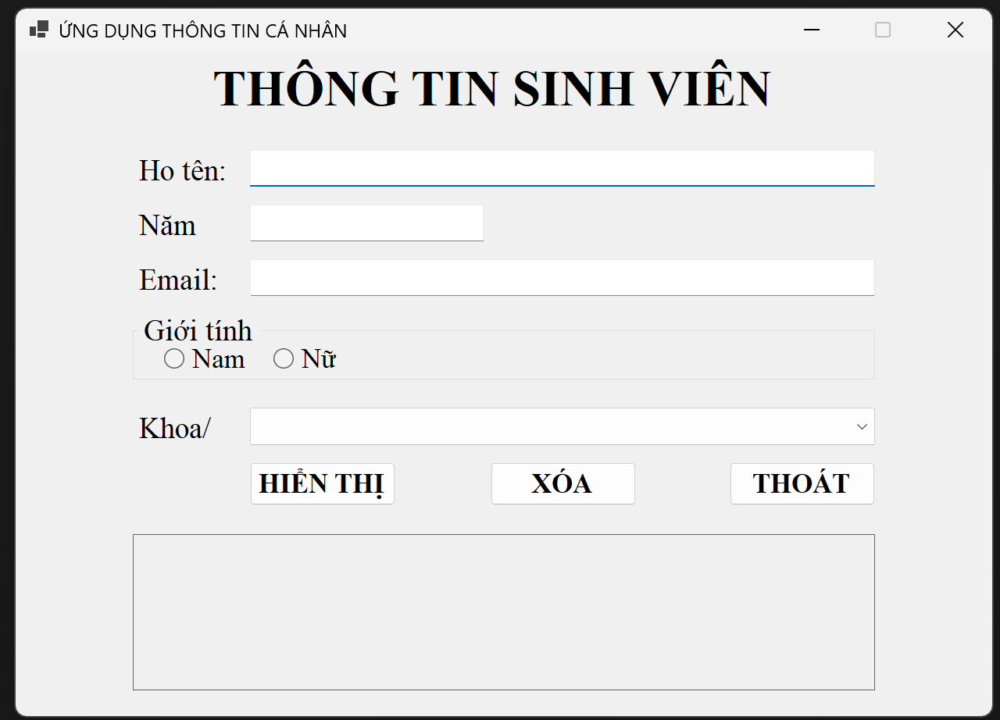
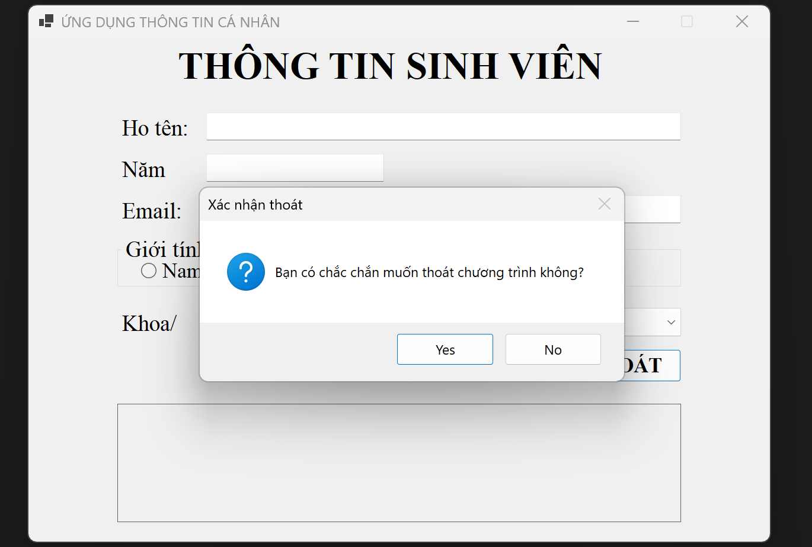

# LAB 01 - THÔNG TIN SINH VIÊN

## 1. Giới thiệu

Ứng dụng Windows Forms được xây dựng bằng C#, cho phép nhập và hiển thị thông tin sinh viên.

**Thông tin gồm:**

- Họ tên
- Năm sinh
- Email
- Giới tính
- Khoa/Lớp

---

## 2. Giao diện chương trình

---

## 3. Chức năng HIỂN THỊ

Người dùng nhập đầy đủ thông tin và nhấn **HIỂN THỊ**.

Chương trình kiểm tra dữ liệu, tính tuổi và hiển thị:

- Họ tên
- Tuổi
- Email
- Giới tính
- Khoa/Lớp

---

## 4. Kiểm tra dữ liệu

### 4.1. Không nhập họ tên

> Vui lòng nhập họ tên!

### 4.2. Năm sinh không hợp lệ

> Năm sinh không hợp lệ!

### 4.3. Email không hợp lệ

> Email không đúng định dạng!

### 4.4. Chưa chọn giới tính

> Vui lòng chọn giới tính!

### 4.5. Chưa chọn khoa/lớp

> Vui lòng chọn khoa/lớp!

---

## 5. Chức năng XÓA

Nút **XÓA** dùng để xóa toàn bộ thông tin đã nhập và đưa giao diện về trạng thái ban đầu.

---

## 6. Chức năng THOÁT

Nút **THOÁT** hiển thị hộp thoại xác nhận.

- Chọn **Yes**: kết thúc chương trình.
- Chọn **No**: tiếp tục sử dụng chương trình.

---

## 7. Danh sách khoa

- Khoa Ngữ Văn
- Khoa Toán - Tin học
- Khoa Công nghệ thông tin
- Khoa Vật lý
- Khoa Hóa học
- Khoa Sinh học
- Khoa Lịch sử
- Khoa Địa lý
- Khoa tiếng Anh
- Khoa tiếng Pháp
- Khoa tiếng Nga
- Khoa tiếng Trung
- Khoa tiếng Nhật
- Khoa tiếng Hàn quốc
- Khoa Giáo dục chính trị
- Khoa Tâm lý học
- Khoa Khoa học Giáo dục
- Khoa Giáo dục Tiểu học
- Khoa Giáo dục Mầm non
- Khoa Giáo dục Quốc phòng
- Khoa Giáo dục đặc biệt
- Khoa Giáo dục Thể chất

---

## 8. Kết luận

Chương trình hoàn thành các chức năng nhập, kiểm tra, hiển thị và xóa thông tin sinh viên bằng C# Windows Forms.