# LAB 02 - QUẢN LÝ MẢNG SỐ NGUYÊN

## 1. Giới thiệu

Chương trình Console được xây dựng bằng C#, dùng để nhập, xuất và xử lý mảng số nguyên thông qua menu.

---

## 2. Menu chương trình

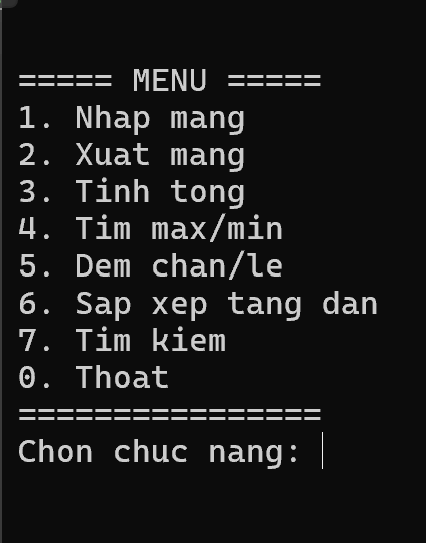

Chương trình gồm các chức năng:

- Nhập mảng
- Xuất mảng
- Tính tổng
- Tìm Max/Min
- Đếm số chẵn/lẻ
- Sắp xếp tăng dần
- Tìm kiếm phần tử
- Thoát chương trình

---

## 3. Nhập mảng

Người dùng nhập số lượng phần tử `n` và các phần tử của mảng.

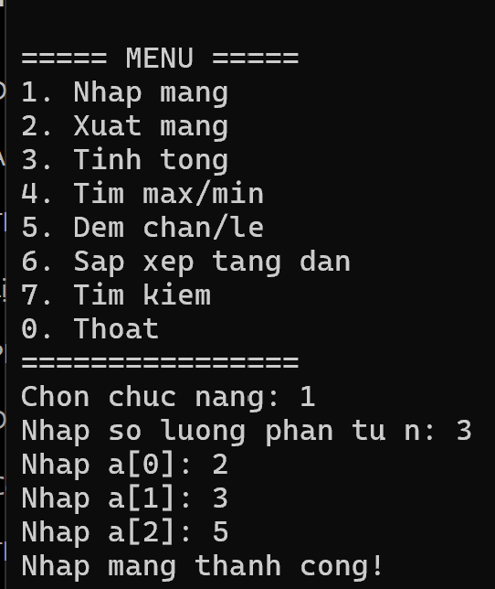

---

## 4. Xuất mảng

Hiển thị các phần tử đã nhập trong mảng.

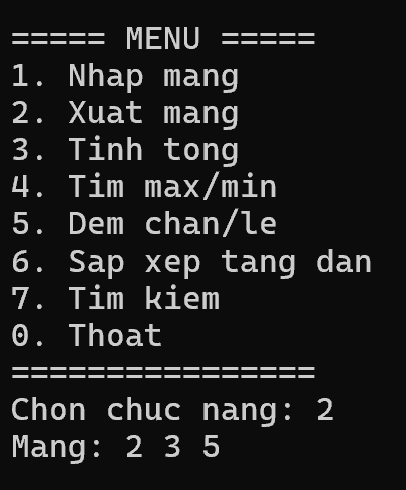

---

## 5. Tính tổng

Chương trình tính tổng tất cả các phần tử trong mảng.

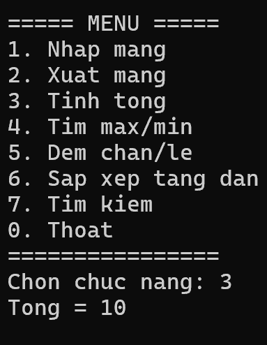

---

## 6. Tìm Max/Min

Tìm và hiển thị giá trị lớn nhất và nhỏ nhất trong mảng.

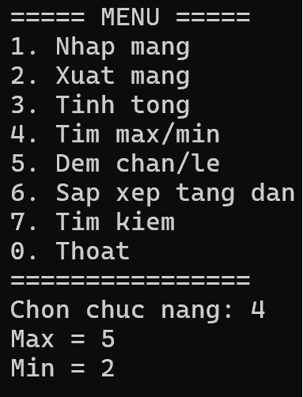

---

## 7. Đếm số chẵn/lẻ

Đếm số lượng phần tử chẵn và số lượng phần tử lẻ trong mảng.

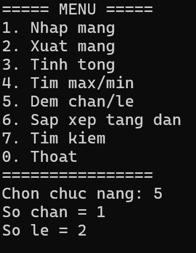

---

## 8. Sắp xếp tăng dần

Sắp xếp các phần tử trong mảng theo thứ tự tăng dần.

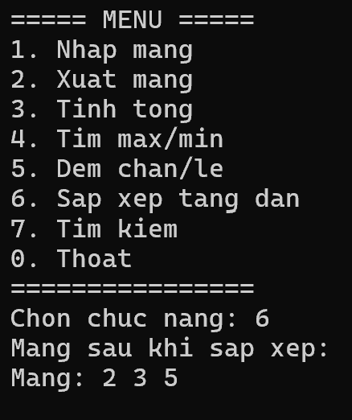

---

## 9. Tìm kiếm

Nhập giá trị `x` và tìm vị trí xuất hiện đầu tiên của `x` trong mảng.

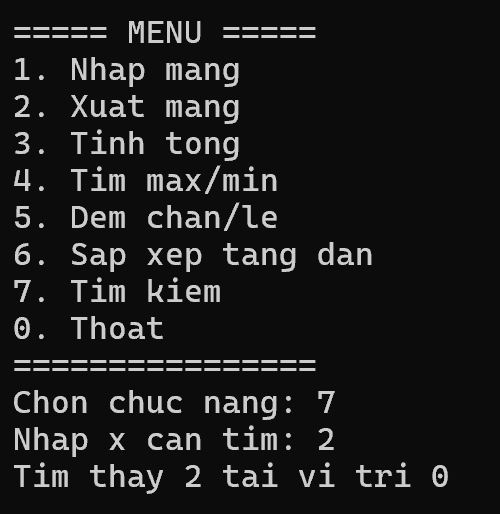

### Trường hợp không tìm thấy

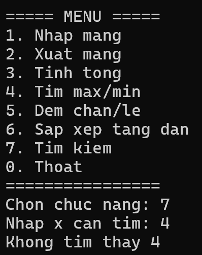

---

## 10. Kiểm tra dữ liệu

Chương trình kiểm tra dữ liệu nhập, đảm bảo số lượng phần tử phải là số nguyên dương.

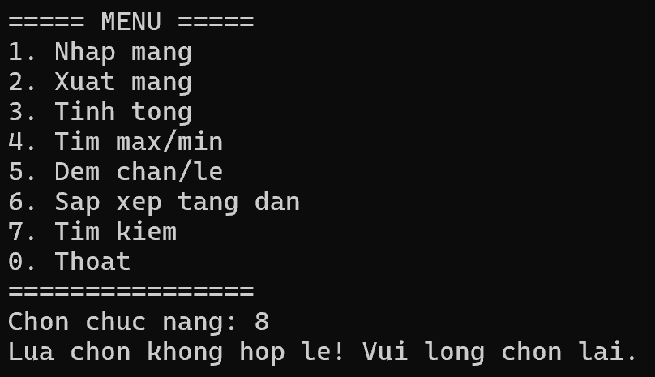

Chương trình cũng xử lý dữ liệu nhập không hợp lệ và yêu cầu người dùng nhập lại.

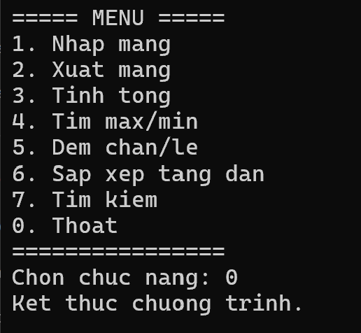

---

## 11. Các phương thức chính

Chương trình được chia thành các phương thức:

- `NhapSoNguyen()`
- `NhapSoNguyenDuong()`
- `NhapMang()`
- `XuatMang()`
- `TinhTong()`
- `TimMax()`
- `TimMin()`
- `DemChan()`
- `DemLe()`
- `SapXepTangDan()`
- `TimKiem()`
- `HienThiMenu()`

---

## 12. Kết luận

Lab02 hoàn thành các chức năng quản lý và xử lý mảng số nguyên bằng C# Console.

Chương trình có menu điều khiển, kiểm tra dữ liệu nhập và sử dụng các phương thức riêng cho từng chức năng.